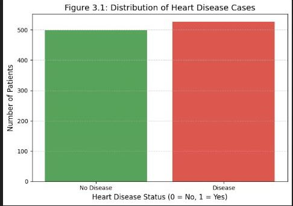
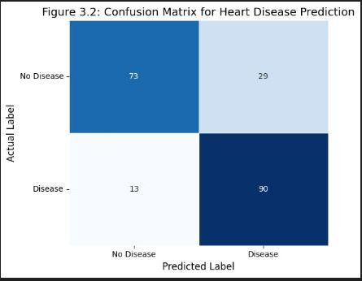
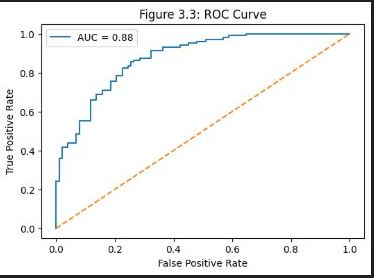

# Heart-Disease-Prediction-ML

Objective

The main goal of this project is to predict whether a person is likely to have heart disease using basic medical and health-related information. This kind of prediction can help in early detection and awareness.

Dataset

We used the Heart Disease UCI dataset, which is publicly available on Kaggle.
The dataset contains common medical features such as age, cholesterol level, blood pressure, heart rate, and chest pain type.

Model Used

Logistic Regression
This model is well-suited for problems where the outcome is either yes or no (heart disease or no heart disease).

Model Evaluation

To understand how well the model performs, we evaluated it using:

Accuracy – how often the model makes correct predictions

Confusion Matrix – shows correct and incorrect predictions clearly

ROC Curve – helps measure how well the model separates patients with and without heart disease

Conclusion

The Logistic Regression model achieved good performance on the dataset.
It was able to correctly identify patients at risk of heart disease using medical features.
This project shows how machine learning can be useful in supporting early health risk assessment, though it should not replace professional medical diagnosis.
